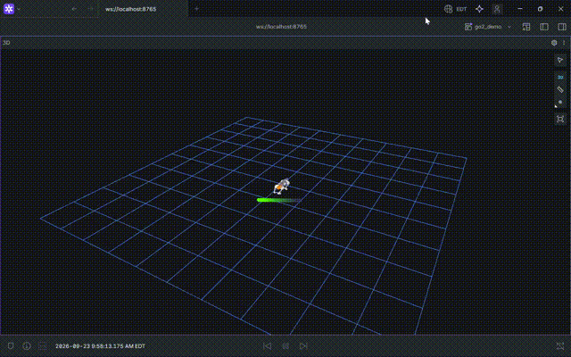

# Otolith

A measured answer to *"what belongs in software, and what belongs in silicon?"*

One contact-aided state estimator — 15-state MEKF, leg odometry from `r_dot` — implemented three times and compared on the same inputs: **C++** on pinned cores, **Rust** over shared memory, and the **same fixed-point pipeline as RTL** carried through Verilator, Yosys/nextpnr, and an open SKY130 flow. Latency, jitter, error, area and power are compared side by side rather than asserted.

Four robots run through it: **Unitree Go2** (3-DoF planar legs) and **Unitree G1**, **Apptronik Apollo**, **Robotis OP3** (6-DoF chains).

## Results

| | pos RMSE | vel RMSE | roll RMSE |
|---|---|---|---|
| Go2 trot, 6 s @500 Hz | 0.021 m | 0.052 m/s | 0.85° |
| G1 quasi-static, 6 s | 0.019 m | 0.071 m/s | 0.49° |
| Apollo quasi-static, 6 s | 0.038 m | 0.084 m/s | 0.71° |
| OP3 quasi-static, 6 s | 0.008 m | 0.059 m/s | 1.02° |

| silicon | measurement |
|---|---|
| `predict_core` (P ← ΦPΦᵀ + Qd, 15×15) | ECP5 **40,337 LUT (48%), 0 DSP**, Fmax 65.8 MHz |
| `ldl_kernel` (LDL' factor + solve) | bit-parity **9002/9002** on real covariances; Fmax 13.91 MHz; 91 µs = **22× inside** the 2 ms budget |
| `mul48_kernel` | 0.119 mm² SKY130, DRC/antenna clean |
| full fixed-point filter | 0.3072 m vs 0.3083 m float-update, **0 saturations** |

**The partition, and why.** Silicon took the covariance predict pipeline and the `ldl_kernel` — fixed-shape, division-free, running every sample. Software kept the measurement model, `apply_dx`, and the 15×15 Joseph form. The Joseph form is **54% of the update's cost** and was the obvious candidate to move; measured, the full update is **~10.19 mm² of sky130**, 3× a predict core already found unplaceable in a 1600×1600 die. The `ldl_kernel` is the instructive exception: **0.3% of the arithmetic**, promoted because cancellation and dynamic range are hard to get right — a `(k,j)`/`(j,k)` index swap became a 13% `P'` error. It was a correctness retirement, not a cost decision.

Full derivation: [`hdl/M5_UPDATE_STUDY.md`](hdl/M5_UPDATE_STUDY.md), [`docs/decisions/0007-rtl-port.md`](docs/decisions/0007-rtl-port.md).

## Demo

```bash
./scripts/go2_demo.sh        # sim + fusion + viz + bridge
# Foxglove Studio (Windows) → ws://localhost:8765, load foxglove/go2_demo.json
```



## Architecture

```
MuJoCo (500 Hz)                                    ┌─ C++ (pinned cores)
  ├─ IMU gyro+accel (bias + noise)   ─┐            ├─ Rust (shared memory)
  ├─ 12× joint encoders              ─┼─► contact-aided MEKF ─► base state
  └─ foot contacts                   ─┘        [hot path: C++ → Rust → RTL]
                                              └─ RTL (predict_core, ldl_kernel)
ROS 2 (rmw_zenoh): sensor drivers, bridge        ▲
Foxglove (Windows) ◄── foxglove_bridge WebSocket ─┘
```

The hot path never touches ROS 2 middleware. ROS 2 lives at the edges for ecosystem fluency; the deterministic path is typed shared memory and fixed-size structs.

## Layout

```
sim/     MuJoCo scenes + sensor layer (noise models, rates)
fusion/  MEKF hot path — C++17, Catch2, zero-alloc
hdl/     RTL: SystemVerilog, testbenches, yosys/OpenLane configs
rust/    v0.3 iceoryx2 port
ros2/    ROS 2 wrappers (edges only, never the hot path)
eval/    RMSE vs ground truth, jitter histograms, plots
mech/    CAD/FEA + leg descriptors for the bipeds
docs/    Design notes and ADRs
```

## Phases

| Phase | Scope | Status |
|---|---|---|
| v0.1 | Go2 sim + sensor layer, MEKF, eval harness, Foxglove wiring | **done** |
| v0.2 | Transport bake-off: ROS 2 vs shared memory vs iceoryx2 | **done** — [ADR-0005](docs/decisions/0005-transport-bakeoff.md) |
| v0.3 | Rust port, 1e-9 differential vs C++ | **done** — [ADR-0006](docs/decisions/0006-rust-port.md) |
| v0.4 | RTL port: predict pipeline → Verilator parity → Yosys/OpenLane PPA | **done** — [ADR-0007](docs/decisions/0007-rtl-port.md) |
| v0.5 | Humanoid reuse: G1, Apollo, OP3 through the same seam | **done** — [V05](docs/V05_HUMANOID.md) |
| v0.6 | Mechanical: CAD the leg, FEA the links, design the board | analytical phases A–D **closed** — [V06](docs/V06_PREREQS_CLOSED.md) |

## Environment

Two-OS split; the engine and all builds live on the Linux filesystem, never `/mnt/c`.

- **WSL2 Debian** — pixi (ROS 2 Jazzy, `rmw_zenoh`, `foxglove-bridge`), MuJoCo, C++/Rust/RTL toolchains.
- **Windows 11** — Foxglove Studio (native) at `localhost:8765`; VS Code via WSL Remote.

Agent-level detail and exact commands: [`CLAUDE.md`](CLAUDE.md).

## References

- [CAPO](https://github.com/ShineMinxing/CAPO-LeggedRobotOdometry) (arXiv:2602.17393) — prior art and benchmark target; Otolith's differentiator is the compute-partitioning bake-off, not estimator novelty
- [MuJoCo Menagerie](https://github.com/google-deepmind/mujoco_menagerie) — Go2 / G1 / Apollo / OP3 models
- [RoboStack](https://robostack.github.io/) · [rmw_zenoh](https://github.com/ros2/rmw_zenoh) · [iceoryx2](https://github.com/eclipse-iceoryx/iceoryx2)
- [OpenLane2](https://github.com/efabless/openlane2) + [SKY130 PDK](https://skywater-pdk.readthedocs.io/) — open RTL-to-GDS flow